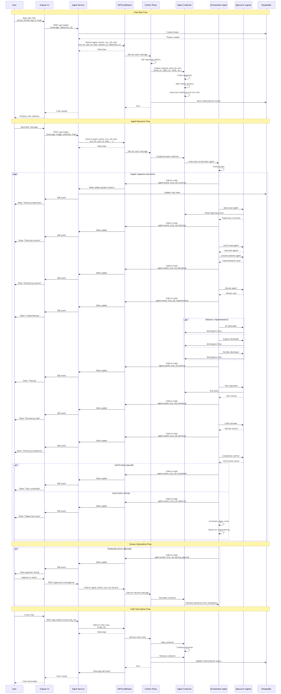
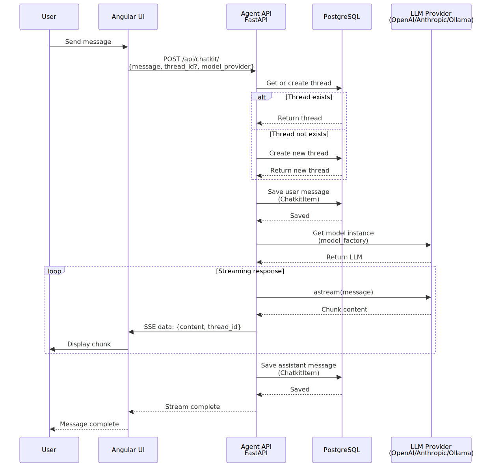
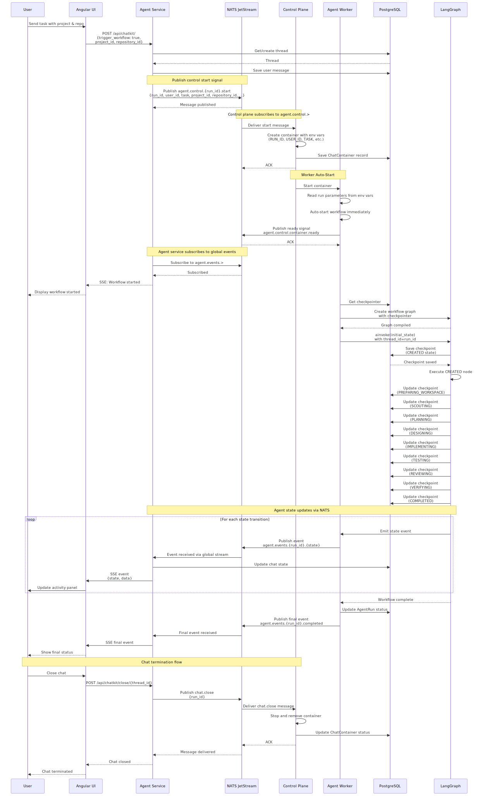
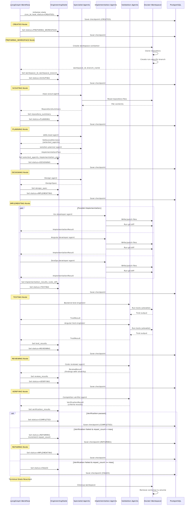
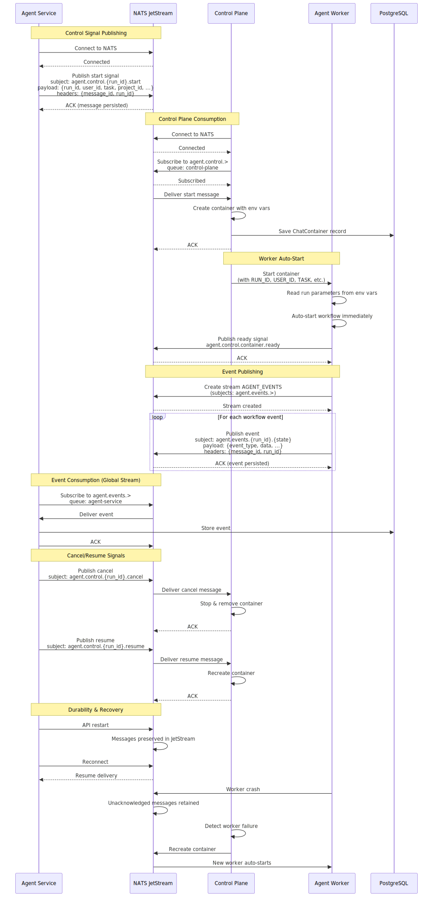
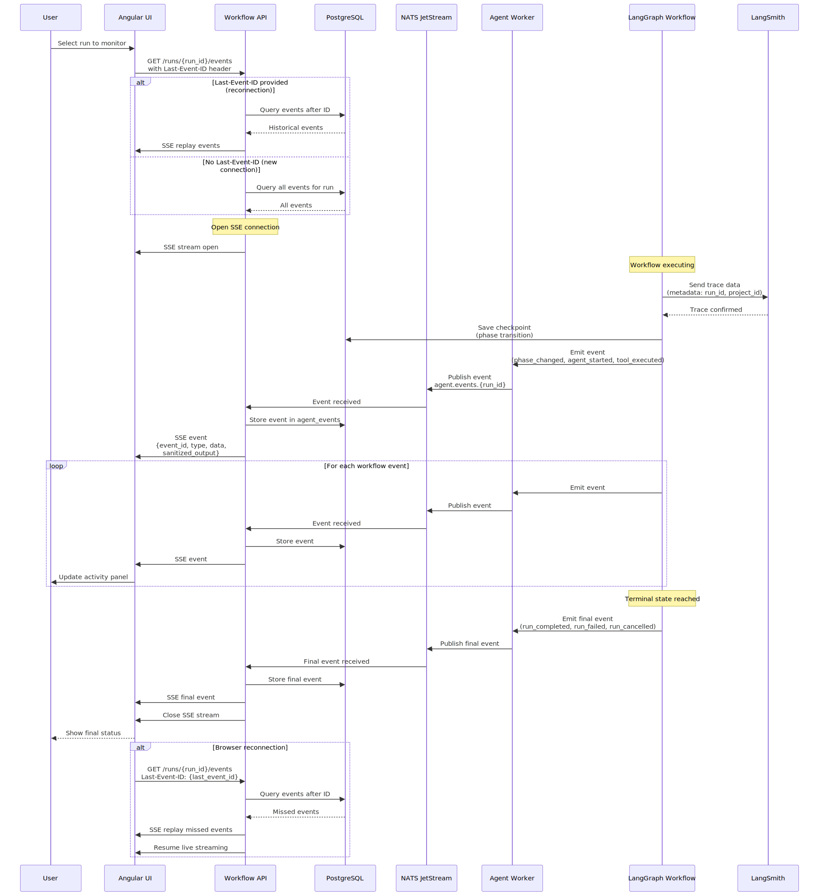
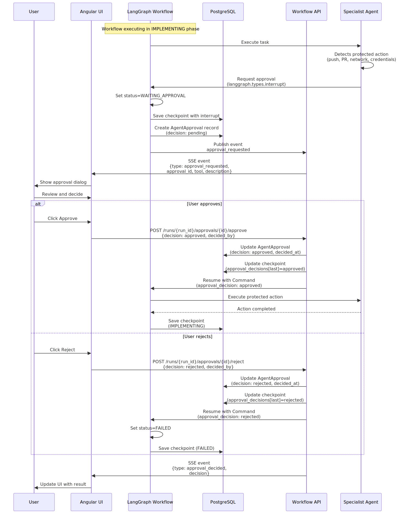
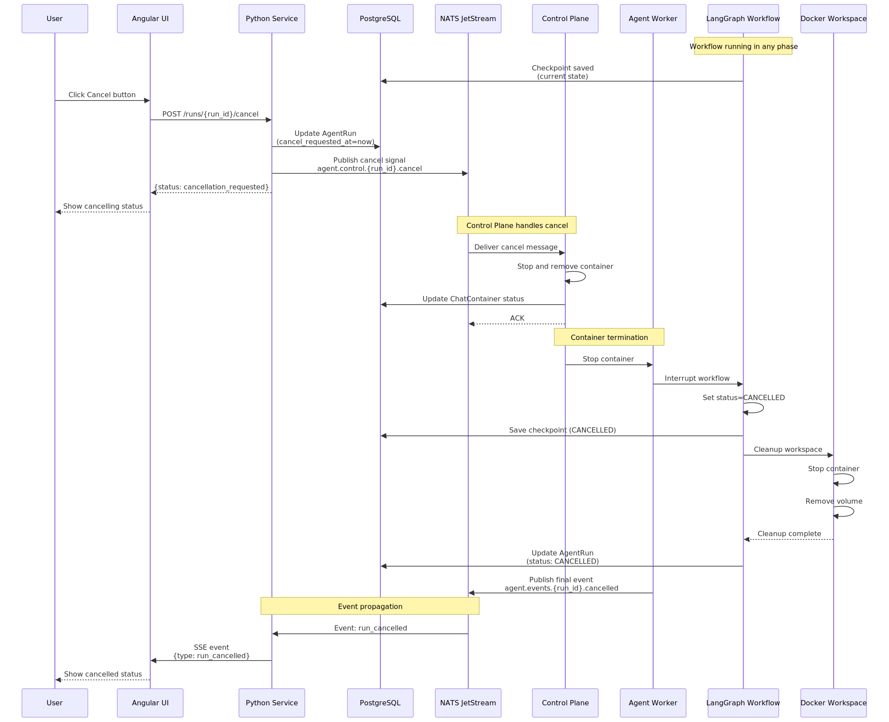

# Agentic Engineering Platform

A complete agentic engineering platform with Angular UI, Go control plane, and Python agent service.

## AI-Engineered Architecture

This platform represents a breakthrough in autonomous software engineering, entirely architected and implemented by **SWE-1.6** within the **Devin IDE** environment. The system demonstrates advanced AI capabilities including:

- **Autonomous System Design**: Multi-service architecture with Go, Python, and Angular orchestrated through intelligent decision-making
- **Complex Workflow Orchestration**: LangGraph-based state machines managing 15 distinct agent workflow phases
- **Specialist Agent Collaboration**: 11+ specialized AI agents working in parallel with conflict resolution
- **Real-time Event Streaming**: SSE-based live agent activity with browser reconnection support
- **Secure Container Isolation**: Docker-based workspace management with resource limits and security controls
- **Human-in-the-Loop Approval**: LangGraph interrupts for sensitive operations requiring human oversight

The implementation showcases SWE-1.6's ability to reason about complex distributed systems, implement production-grade code across multiple languages, and create cohesive documentation—all autonomously within a single development session.

## Architecture

- **Control Plane**: Go service managing users, organizations, projects, and repositories
  - See [services/control-plane/README.md](services/control-plane/README.md) for details
- **Agent Service**: Python FastAPI service with ChatKit integration and LangGraph workflows
  - See [services/agent-service/README.md](services/agent-service/README.md) for details
- **Agent Worker**: Python worker for isolated LangGraph workflow execution
  - See [services/agent-worker/README.md](services/agent-worker/README.md) for details
- **Web UI**: Angular 22+ application with standalone components

## Quick Start

### Prerequisites

- Docker and Docker Compose
- Go 1.23+ (for local development)
- Node.js 22+ (for local development)
- Python 3.12+ (for local development)
- Ollama (optional, for real LLM support)

### Using the Makefile

The root Makefile provides convenient targets for managing the deployment:

```bash
# Start all services with real LLM (Ollama)
make clean-start

# Start all services with mock LLM (for testing)
make mock-llm-start

# Stop all services
make compose-down

# Build containers manually
make build-containers

# Start services (without clean)
make compose-up
```

### Using Docker Compose Directly

```bash
# Start with real LLM (Ollama)
docker-compose up -d

# Start with mock LLM
LLM_PROVIDER=fake docker-compose up -d
```

This will start:
- PostgreSQL on port 5432
- Control Plane API on port 8080
- Agent Service on port 8000
- Web UI on port 4200
- NATS on port 4222

### LLM Provider Configuration

The platform supports two LLM modes:

1. **Real LLM (Ollama)**: Default mode using local Ollama instance
   - Requires Ollama running locally: `ollama serve`
   - Worker containers connect to `http://host.docker.internal:11434`
   - Select Ollama models in the UI chat configuration

2. **Mock LLM (Fake)**: Testing mode with simulated responses
   - No external dependencies
   - Faster for testing workflows
   - Use `make mock-llm-start` or `LLM_PROVIDER=fake docker-compose up -d`

### Local Development

#### Control Plane (Go)

```bash
cd services/control-plane
make dev
```

#### Agent Service (Python)

```bash
cd services/agent-service
uv sync
uv run alembic upgrade head
uv run uvicorn app.main:app --reload
```

#### Agent Worker (Python)

```bash
cd services/agent-worker
uv sync
uv run python -m app.worker --run-id <run_id> --nats-url nats://localhost:4222
```

#### Web UI (Angular)

```bash
cd apps/web
npm install
npm start
```

## API Endpoints

### Control Plane (port 8080)

- `GET /healthz` - Health check
- `GET /readyz` - Readiness check
- `POST /api/v1/auth/login` - User login
- `POST /api/v1/auth/register` - User registration
- `GET /api/v1/projects` - List projects
- `POST /api/v1/projects` - Create project
- `GET /api/v1/repositories` - List repositories
- `POST /api/v1/repositories` - Create repository

### Agent Service (port 8000)

- `GET /healthz` - Health check
- `GET /readyz` - Readiness check
- `POST /chatkit/` - Chat endpoint with streaming
- `GET /chatkit/threads/{thread_id}` - Get thread history

## Project Structure

```
ai-platform-swe-1.6-gen/
├── apps/
│   └── web/                 # Angular 22+ UI application
│       ├── src/
│       │   ├── app/
│       │   │   ├── core/           # Core services (HTTP, auth, config)
│       │   │   ├── auth/           # Authentication module
│       │   │   ├── projects/       # Project management
│       │   │   ├── chat/           # Chat interface with ChatKit
│       │   │   ├── activity/       # Agent activity timeline
│       │   │   ├── artifact-viewer/ # Artifact display (diffs, reports)
│       │   │   ├── diff-viewer/    # Code diff viewer
│       │   │   ├── approval-dialog/ # Human approval dialog
│       │   │   └── run-context/    # Run metadata display
│       │   └── main.ts
│       ├── package.json
│       ├── angular.json
│       └── Dockerfile
├── services/
│   ├── control-plane/       # Go 1.23+ control plane service
│   │   ├── cmd/
│   │   │   └── server/
│   │   │       └── main.go        # Service entry point
│   │   ├── internal/
│   │   │   ├── config/            # Configuration management
│   │   │   ├── db/                # Database connection
│   │   │   ├── handlers/          # HTTP handlers
│   │   │   ├── middleware/        # HTTP middleware (auth, CORS)
│   │   │   ├── models/            # Data models
│   │   │   ├── repository/        # Data access layer
│   │   │   ├── service/           # Business logic
│   │   │   └── orchestrator/      # Container orchestration
│   │   ├── migrations/            # Database migrations
│   │   ├── Makefile
│   │   ├── go.mod
│   │   └── Dockerfile
│   └── agent-service/       # Python 3.12+ agent service (HTTP API + messaging layer)
│       ├── app/
│       │   └── main.py            # FastAPI application
│       ├── internal/
│       │   ├── agents/            # Shared specialist agents library
│       │   │   ├── factory.py     # Agent creation
│       │   │   ├── schemas.py     # Pydantic schemas
│       │   │   ├── specialists.py # Planning agents
│       │   │   ├── implementers.py # Implementation agents
│       │   │   └── validators.py  # Validation agents
│       │   ├── chatkit/           # ChatKit integration
│       │   │   ├── router.py      # Chat endpoints
│       │   │   ├── server.py      # AegisChatKitServer (SSE streaming)
│       │   │   ├── nats_bridge.py # NATS event subscription bridge
│       │   │   ├── event_mapper.py # Event mapping to ChatKit protocol
│       │   │   ├── context.py     # Request context helpers
│       │   │   └── store.py       # PostgreSQL thread/message store
│       │   ├── config.py          # Configuration
│       │   ├── db.py              # Database connection
│       │   ├── event_streams.py   # SSE event streaming infrastructure
│       │   ├── handlers/         # NATS message handlers
│       │   ├── messaging/         # NATS messaging
│       │   │   └── nats.py        # NATS client
│       │   ├── models.py          # SQLAlchemy models
│       │   ├── skills/            # Skill system
│       │   │   ├── registry.py    # Skill loader
│       │   │   └── snapshots.py   # Skill versioning
│       │   └── tools/             # Agent tools
│       │       ├── repository.py  # Read-only repo tools
│       │       └── workspace.py   # Workspace tools
│       ├── migrations/            # Alembic migrations
│       ├── tests/                 # Test suites
│       │   ├── e2e/              # End-to-end tests
│       │   ├── security/         # Security tests
│       │   └── fixtures/         # Test repositories
│       ├── .agents/               # Skill definitions
│       │   ├── minimal/          # Minimal skill set
│       │   └── full/             # Full skill set
│       ├── pyproject.toml
│       ├── alembic.ini
│       └── Dockerfile
│   └── agent-worker/        # Python worker for isolated workflow execution
│       ├── app/             # Worker application
│       ├── internal/        # Worker internals
│       ├── tests/           # Worker tests
│       ├── Dockerfile.worker
│       └── Makefile
├── deploy/                  # Deployment configurations
│   ├── docker-compose.yml   # Docker Compose orchestration
│   └── kubernetes/          # Kubernetes manifests (future)
├── contracts/               # API contracts and schemas
├── docs/                    # Documentation
│   ├── architecture/        # Architecture diagrams
│   ├── operations/          # Operational documentation
│   └── threat-model/        # Security threat model
├── PROGRESS.md             # Implementation progress
├── README.md               # This file
└── IMPLEMENTATION_PLAN.md   # Detailed implementation plan
```

## Implementation Phases

1. ✅ Phase 1: Foundation (Go + Infrastructure)
2. ✅ Phase 2: Angular UI + Python ChatKit
3. ✅ Phase 3: LangGraph Workflow Skeleton
4. ✅ Phase 4: Skills and Read-Only Agents
5. ✅ Phase 5: Workspace Isolation
6. ✅ Phase 6: Implementation Agents
7. ✅ Phase 7: Testing, Review, Verification
8. ✅ Phase 8: Human Approval
9. ✅ Phase 9: Activity and Artifact UX
10. ✅ Phase 10: NATS Worker Separation
11. ✅ Phase 11: Hardening and Evaluation
12. ✅ Phase 12: Agent Container Creation Flow
13. ✅ Phase 13: Architecture Refactoring - Service Separation

See [PROGRESS.md](PROGRESS.md) for detailed implementation status.

## Agent Container Creation Flow

The platform now supports complete end-to-end agent container creation with a simplified control flow:

1. **User Chat Message** → Agent Service receives chat request via `POST /chatkit/`
2. **SSE Stream Initiated** → `AegisChatKitServer.respond()` returns an SSE stream
3. **Container Creation** → Agent Service publishes `agent.control.{run_id}.start` to NATS with all run parameters
4. **Control Plane** → Receives `agent.control.{run_id}.start`, creates container with environment variables
5. **Worker Auto-Start** → Container starts, worker reads run parameters from environment and auto-starts workflow
6. **State Events** → Worker publishes state events to `agent.events.{run_id}.{event_type}`
7. **Event Streaming** → Agent Service receives events via global event stream and yields as ChatKit SSE events
8. **UI Rendering** → Angular `chat.component.ts` parses SSE events and updates the chat UI

### Control Signals

All control signals use the unified `agent.control.*` pattern:
- `agent.control.{run_id}.start` - Start run with all parameters (user_id, task, project_id, etc.)
- `agent.control.{run_id}.cancel` - Cancel run (stop & remove container)
- `agent.control.{run_id}.resume` - Resume run (recreate container)

### Worker Auto-Start

The worker no longer listens to NATS commands. Instead:
- Worker reads run parameters from environment variables (USER_ID, TASK, PROJECT_ID, etc.)
- Worker auto-starts the workflow immediately on container startup
- This eliminates the need for a separate `run.start` command

### Event Streaming

Worker publishes state events to:
- `agent.events.{run_id}.{event_type}` - State transition events

Agent Service subscribes to global event stream and forwards to UI via SSE.

### Current Limitations

- **Memory Checkpointer**: Using in-memory checkpointer instead of PostgreSQL (temporary workaround for LangGraph API issues)
- **Mock Docker Mode**: Container creation is simulated when `MOCK_DOCKER=true` (no actual Docker containers)
- **Mock Responses**: The `mock-worker` returns predefined responses (no actual LLM calls)
- **Icon Validation**: Fixed invalid `loader` icon literal by mapping it to `agent`

These limitations are acceptable for testing the message flow and can be addressed in future iterations.

## Phase 13: Architecture Refactoring - Service Separation

In Phase 13, the architecture was refactored to properly separate concerns between the agent-service and agent-worker:

### Key Changes

- **Removed LangGraph workflow execution code from agent-service**: All workflow execution logic (graph, nodes, router, state, checkpointer, approvals) was moved to agent-worker
- **agent-service now handles**: HTTP API, NATS messaging, SSE streaming, PostgreSQL store
- **agent-worker now handles**: LangGraph workflow execution, real agent implementations, workspace operations
- **Shared library**: `internal/agents/` remains a shared library used by both services for specialist agents
- **Event streaming infrastructure**: Moved `event_streams.py` from `internal/workflow/` to `internal/event_streams.py` for clarity

### Architecture Benefits

- **Clear separation of concerns**: API layer (agent-service) is completely separate from execution layer (agent-worker)
- **Scalability**: Worker processes can be scaled independently of the API service
- **Maintainability**: Workflow execution code is isolated to the worker service
- **Testing**: Each service can be tested independently

### Message Flow

1. **User Chat Message** → Agent Service receives chat request via `POST /chatkit/`
2. **SSE Stream Initiated** → `AegisChatKitServer.respond()` returns an SSE stream
3. **Container Creation** → Agent Service publishes `agent.control.{run_id}.start` to NATS with all run parameters
4. **Control Plane** → Receives `agent.control.{run_id}.start`, creates container with environment variables
5. **Worker Auto-Start** → Container starts, worker reads run parameters from environment and auto-starts workflow
6. **State Events** → Worker publishes state events to `agent.events.{run_id}.{event_type}`
7. **Event Streaming** → Agent Service receives events via global event stream and yields as ChatKit SSE events
8. **UI Rendering** → Angular `chat.component.ts` parses SSE events and updates the chat UI

## Architecture Diagrams

The platform includes comprehensive UML diagrams documenting the system architecture and message flows:

### Component Diagram



### Sequence Diagrams

#### Chat Lifecycle


#### ChatKit Chat Integration


#### Workflow Trigger


#### LangGraph Workflow


#### NATS Messaging


#### Event Streaming


#### Human Approval


#### Cancellation Flow


### Source Files

The Mermaid source files are available in the `docs/` directory for editing:
- [docs/architecture-component-diagram.mmd](docs/architecture-component-diagram.mmd)
- [docs/sequence-chat-lifecycle.mmd](docs/sequence-chat-lifecycle.mmd)
- [docs/sequence-chatkit-chat.mmd](docs/sequence-chatkit-chat.mmd)
- [docs/sequence-workflow-trigger.mmd](docs/sequence-workflow-trigger.mmd)
- [docs/sequence-langgraph-workflow.mmd](docs/sequence-langgraph-workflow.mmd)
- [docs/sequence-nats-messaging.mmd](docs/sequence-nats-messaging.mmd)
- [docs/sequence-event-streaming.mmd](docs/sequence-event-streaming.mmd)
- [docs/sequence-human-approval.mmd](docs/sequence-human-approval.mmd)
- [docs/sequence-cancellation.mmd](docs/sequence-cancellation.mmd)

### Regenerating Diagrams

To regenerate SVG images after modifying the Mermaid source files:

```bash
# Install mermaid-cli (first time only)
npx @mermaid-js/mermaid-cli --version

# Regenerate all diagrams
npx @mermaid-js/mermaid-cli -i docs/architecture-component-diagram.mmd -o docs/svg/architecture-component-diagram.svg
npx @mermaid-js/mermaid-cli -i docs/sequence-chat-lifecycle.mmd -o docs/svg/sequence-chat-lifecycle.svg
npx @mermaid-js/mermaid-cli -i docs/sequence-chatkit-chat.mmd -o docs/svg/sequence-chatkit-chat.svg
npx @mermaid-js/mermaid-cli -i docs/sequence-workflow-trigger.mmd -o docs/svg/sequence-workflow-trigger.svg
npx @mermaid-js/mermaid-cli -i docs/sequence-langgraph-workflow.mmd -o docs/svg/sequence-langgraph-workflow.svg
npx @mermaid-js/mermaid-cli -i docs/sequence-nats-messaging.mmd -o docs/svg/sequence-nats-messaging.svg
npx @mermaid-js/mermaid-cli -i docs/sequence-event-streaming.mmd -o docs/svg/sequence-event-streaming.svg
npx @mermaid-js/mermaid-cli -i docs/sequence-human-approval.mmd -o docs/svg/sequence-human-approval.svg
npx @mermaid-js/mermaid-cli -i docs/sequence-cancellation.mmd -o docs/svg/sequence-cancellation.svg
```
